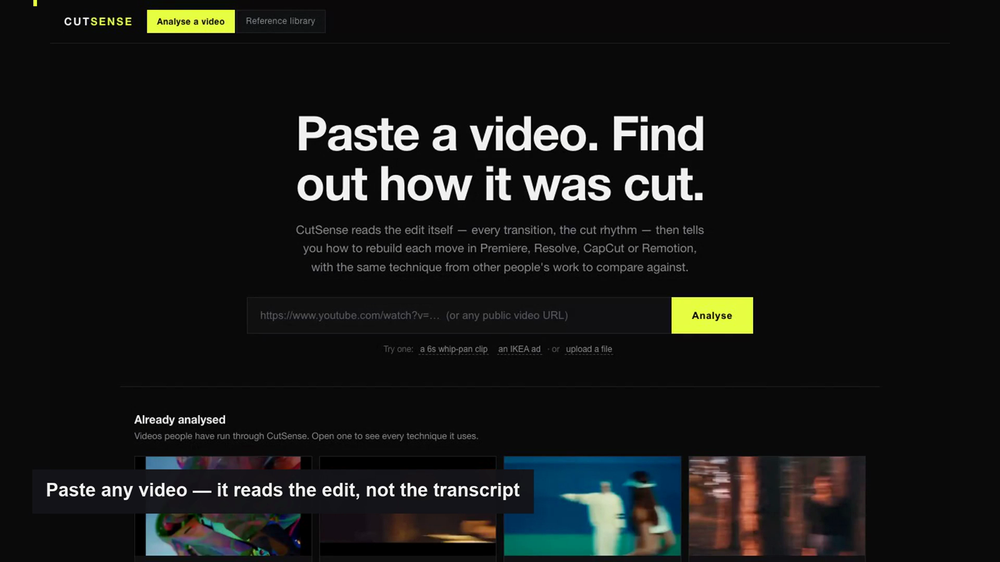
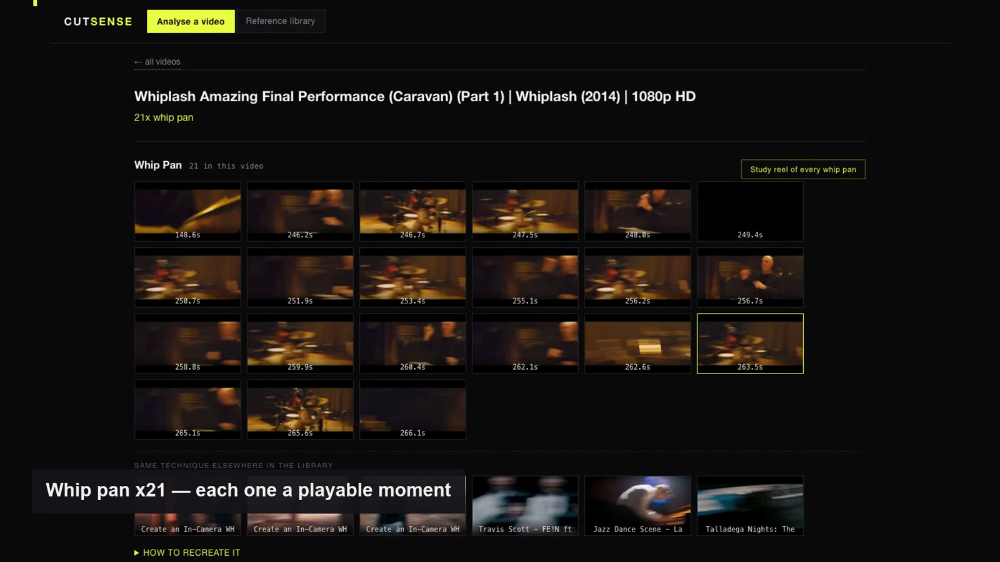
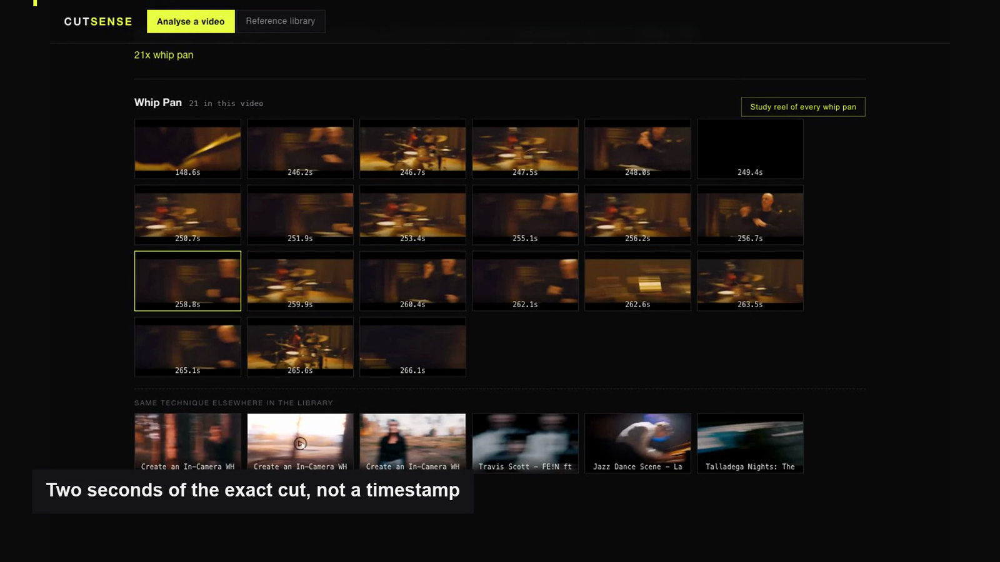
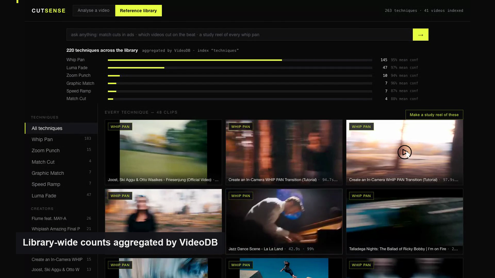
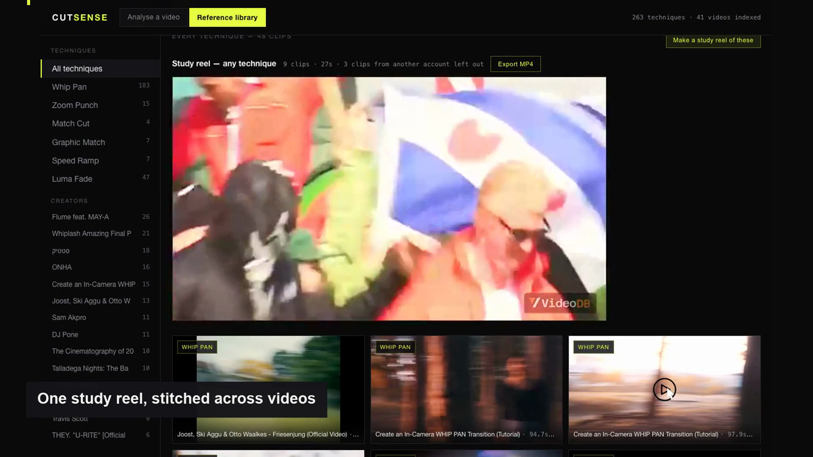

# CutSense

**Paste a video. Find out how it was cut.** CutSense reads the edit itself — not the
transcript — and tells you every technique it uses, where each one lands, and how to
rebuild it. Built on [VideoDB](https://videodb.io).

**Live:** https://cutsense-production.up.railway.app
**Demo:** 77-second walkthrough, submitted with the entry (built by
`scripts/demo_record.py` + `scripts/demo_build.py` from the live site)



## In 200 words

Editors learn by reverse-engineering other people's work: a folder of reference videos,
scrubbed by hand, held together by memory. The knowledge is in the footage and there is
no way to query it.

CutSense makes the edit itself searchable. VideoDB's shot-based scene extraction gives
frame-accurate cut boundaries — those boundaries *are* the edits. At each cut we sample
frames and classify what happened, gated first by deterministic pixel and motion signals
computed locally so the vision model only judges plausible candidates. Six techniques
ship: whip pan, zoom punch, match cut, graphic match, speed ramp, luma fade.

Every result is a playable two-second clip, a poster frame, and a recipe for rebuilding
the move in Remotion, VideoDB's editor timeline, Premiere, Resolve or CapCut. Ask for a
study reel of every whip pan and the editor API stitches one across videos, exportable
to MP4.

A 46-video library of real ads, music videos and films supplies the same technique in
other people's work to compare against, plus per-creator style profiles.

An independent second model audited all 582 detections; refuted ones are hidden. We
report measured precision instead of claiming accuracy.

## What it does

**Analyse.** Paste a URL or upload a file. The report opens on its own page: the
techniques found, where each one lands, and how the edit is paced — cuts per minute,
average shot length, share of cuts under 1.2s, and whether the cutting is rhythmic.



**Playable moments.** Every detection is the exact two seconds around the cut, not a
timestamp to go hunting for. The thumbnail is taken *at* the cut, so a whip pan's smear
is visible before you click.



**Recipes.** Each technique comes with an effect spec (trigger, property delta,
duration, easing, offset, exit policy), then working Remotion code, then what VideoDB's
editor API can and cannot author, then Premiere / Resolve / CapCut steps.

**Reference library.** 46 real videos — ads, music videos, films — so the same technique
in other people's work sits next to yours. Ask in plain language ("match cuts in ads",
"which videos cut on the beat"), browse by technique, or open a creator's style profile.



**Study reels.** One click stitches every instance of a technique into a single
compilation across videos, exportable as MP4.



## Measured, not asserted

An independent second model re-judged all 582 detections. Anything it refuted is hidden
from the app rather than deleted, and the verdict is stored per detection.

| technique | precision | note |
|---|---|---|
| Whip Pan | **60%** | the strongest detector; 166 shown |
| Zoom Punch | **75%** | was 14% until a scale-jump gate replaced the prompt |
| Luma Fade | 48% | |
| Match Cut · Graphic Match · Speed Ramp | not audited | the audit window was wrong for cross-cut techniques; counts are small |

Three further techniques — shake, glitch, split screen — were built, calibrated against
140 windows of ordinary footage, and **deliberately withheld** because the signals did
not separate from normal footage. A small vocabulary that works beats a large one that
misses.

## How VideoDB is used

Ingest (`upload` by URL and file, `youtube_search`) · shot-based `extract_scenes` and
frames · `scene.describe` with model-tier fallback · Search V2 (`index` / `query` /
`aggregate` / `semantic_search`) · scene indexes with metadata · `generate_text` ·
`generate_thumbnail` · `generate_stream` clip windows · `editor` Timeline/Track/Clip
with transitions · `download` for MP4 export.

Detections are published back into VideoDB as a `techniques` index, so the library-wide
counts on the page are computed by `collection.aggregate()`, not by us.

## Setup

```bash
python3.12 -m venv .venv && .venv/bin/pip install -r requirements.txt
cp .env.example .env          # add VIDEO_DB_API_KEY
.venv/bin/python -m uvicorn src.api.app:app --port 8322
```

Useful scripts:

```bash
python scripts/ingest_batch.py 10          # ingest library videos
python scripts/m1_detect.py --all          # detect techniques
python scripts/m2_verify_all.py            # audit detections with a second model
python scripts/m3_push_indexes.py          # publish to VideoDB as a Search V2 index
python scripts/export_snapshot.py          # snapshot the catalog for deploy
python scripts/demo_record.py              # record the demo, then demo_build.py
```

## Docs

- [docs/ARCHITECTURE.md](docs/ARCHITECTURE.md) — how the pipeline fits together
- [docs/LEARNINGS.md](docs/LEARNINGS.md) — every platform finding, measurement and dead end, dated
- [docs/DEMO.md](docs/DEMO.md) — the demo run of show
- [docs/recipes/](docs/recipes/) — the six technique recipes and the shared prompt kit
- [HOSTING.md](HOSTING.md) — Railway deploy, volumes, what survives a redeploy
- [SUBMISSION.md](SUBMISSION.md) — hackathon submission

## About

Built for VideoDB's *Unlock the Footage* hackathon. The detectors, the audit, the
measured precision and the honest gaps are all in `docs/LEARNINGS.md`.
